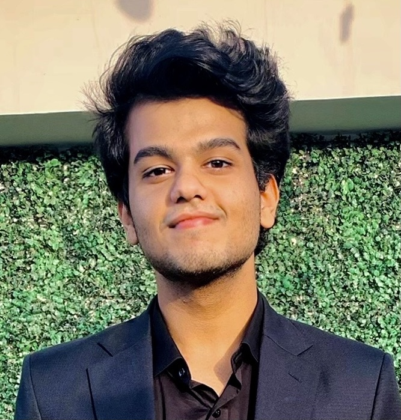

## Siddharth Vohra
***Software & Data Engineer***
> I love working with Data and Programming languages

#### [Here is a meme](meme.jpg)

I am also fairly active on [Twitter](https://www.twitter.com/siddvoh)

I'm gonna tell you about myself and my favorite [lines of code](#lines-of-code), [Restaurants on UCSD Campus](#restaurants-on-ucsd-campus), [Music Artists](#music-artists), and [Cuisines](#cuisines-and-dishes) 

### My Favorites

#### Lines of Code:
```
import numpy as np
import pandas as pd
```

#### Restaurants on UCSD Campus:
1. The Bistro
2. Goody's (RIP)
3. Oceanview Terrace
4. 64

#### Music Artists:
* 1975
* Lauv
* LANY
  
#### Cuisines and Dishes:
1. Indian
   - Butter Chicken
   - Biryani
   - Kebabs
2. Chinese
   - Noodles
   - Stir Fry
3. Japanese
   - Sushi